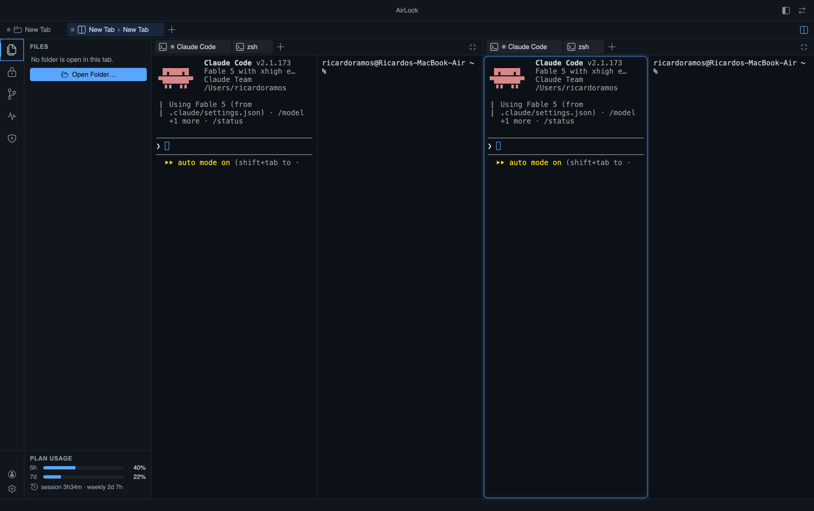

<div align="center">

# AirLock

### The multi-project, Claude-first IDE that can't leak your secrets.

[-black)](#install)
[](LICENSE.md)
[](../../releases)



</div>

AirLock is a terminal-first IDE built around one idea: **your AI agent should
be able to build, run, debug, and deploy your app without ever being *able* to
read your credentials.** Claude Code is a first-class citizen of the IDE, every
project you're juggling lives in one window, and your secrets live in the macOS
Keychain behind a broker that injects them where they're needed and redacts
them everywhere else. Not "the agent promises not to look": **the tools to
look do not exist.**

## Why AirLock

**Multi-project, for real.** Open every project you're working on at once: as
browser-style tabs in one window, side-by-side splits, or separate OS windows.
Each project keeps its own terminals, file tree, git view, secrets, and
databases alive in the background; switching tabs loses nothing. Within a
project, terminals, files, diffs, and database tables open as tabs in the main
area, and any two can be split side by side (coexisting splits, a "scene" per
tab).

**Claude-first, not Claude-bolted-on.** New project terminals auto-start
`claude` (configurable). Each project tab carries a live Claude status dot,
and glows when Claude finishes in a tab you aren't watching. A plan-usage meter
sits in the sidebar (your 5-hour and 7-day windows, with session/weekly reset
countdowns) and clicks through to a full per-session usage dashboard. And
through a local MCP bridge, the Claude in your terminal can **see and drive
the IDE itself**: 28 tools and a built-in manual (see below).

**Your secrets stay yours.** Credentials are vaulted in the macOS Keychain and
injected into terminals at spawn, so no `.env` ever sits on disk. The agent can
*use* a secret (run a migration against your `DATABASE_URL`) but never *see*
it: values are injected main-process-side and redacted out of every output that
reaches the agent. Commits are scanned for leaked secret values before they
land. Every broker operation is hash-chain audited. By design there are **no
third-party extensions**; the attack surface stays closed.

## Install

**[Download the latest DMG from Releases](../../releases)** (macOS, Apple
Silicon), open it, and drag **AirLock** into **Applications**.

First launch: macOS will say it *"could not verify AirLock is free of
malware"*, because AirLock is ad-hoc signed, not notarized (no $99 Apple
Developer account). One-time fix: **System Settings → Privacy & Security →
"Open Anyway"**, or in a terminal: `xattr -cr /Applications/AirLock.app`.

For the full Claude experience, have [Claude Code](https://claude.com/claude-code)
installed; AirLock auto-detects it.

## The tour

### Terminals own the main area

A full multi-terminal panel: tabs (`+` to spawn, double-click to rename; a
manual rename pins the title against the shell's auto-titles), side-by-side
splits, and buffers that survive tab switches because background terminals are
never torn down. Each terminal inherits your login-shell `PATH`/locale, so
Homebrew tools work even when AirLock is launched from Finder.

### Projects: tabs, windows, splits

A project strip shows one tab per open project; the file tree, git, secrets,
and the agent all follow the active tab while every tab's terminals keep
running. The **split** button puts two projects side by side, each a full
project view; the focused pane is what Claude and the menus act on (**one
agent at a time**, always on what you're looking at). Blank tabs (`⌘T`) give
you a shell with no folder; opening a folder into one keeps any running
session alive. Prefer separate OS windows per project? Flip one setting. Turn on
**session restore** and your projects, tabs, and splits come back on relaunch,
each tab's Claude session resuming when you focus it. Right-click a project tab
for a generated **Overview** dashboard of its language/tech mix, README, and
live status.

### Claude integration

- **Auto-start:** new project terminals run `claude` for you (`off` / once
  per tab / every terminal).
- **Status dots + glow:** see at a glance which project's Claude is working,
  and get a glow when one finishes in the background.
- **Plan usage meter:** your account's 5h/7d windows with live reset
  countdowns, pinned in the sidebar; click for the **Usage dashboard** with
  per-session and per-model API time, cost, lines changed, and context size.

### Claude can drive the IDE (MCP bridge)

AirLock runs a local MCP server (loopback-only, bearer-token-guarded) that the
Claude Code in its terminal connects to automatically. No extra setup, no
second API key. **28 tools**, and a built-in manual so the agent understands
the IDE without you explaining it:

- **See every status:** git, databases (reachability, never passwords), Neon,
  Docker, Render deploys, Azure Web Apps, local dev-server health, the live
  Activity feed, your secret *names*, a project profile (`project_info`), and its
  own **plan usage** (`plan_usage`).
- **Drive the layout:** open/close/switch project tabs, split views, spawn or
  kill terminals, type into a terminal (with your approval), and open the
  Settings/Usage pages. Ask "set up my workspace for this repo" and watch it
  happen.
- **Curate the sidebar:** show or hide sections to fit the project; dismiss
  finished Activity entries.
- **Act with your secrets, blindly:** `run_command` injects named vaulted
  secrets into one command's environment and **redacts the values from the
  output**; `git_commit` scans staged content and **blocks commits that contain
  a secret value**; `request_secret` pops a secure prompt so *you* vault what
  it needs; `get_terminal_tail` reads terminal output with every vaulted value
  redacted.

**The boundary:** a test-enforced allowlist locks the tool set. No tool
returns a secret value, ever, and a tool that could fails the build. Claude
Code asks for your approval on first use; nothing happens behind your back.

### Secrets

Vaulted in the macOS Keychain, scoped per project. `Import .env` migrates an
existing file (deleted only after every entry vaults cleanly). Injection
happens at terminal spawn; loader-hijack names (`PATH`, `DYLD_*`,
`NODE_OPTIONS` and friends) are stripped and audited. You (the human) can
reveal or copy a value from the sidebar; the clipboard auto-clears. Every
broker operation lands in a hash-chained audit log
(`.airlock/audit/log.jsonl`).

### Everything else in the sidebar

- **Git:** branch switcher, one-click stage/unstage, commit box, click-through
  unified diffs, right-click a change to stage/discard/open/copy, and undo the
  last commit. Push/pull/merge: the terminal is right there.
- **Databases:** every `postgres-url` secret becomes a live connection (status
  dot via `SELECT 1`), expandable to tables, browsable in a read-only grid.
  Passwords never cross into the UI. A **Neon** group browses
  organizations → projects → branches → databases → tables, with a separate
  keychain-stored API key per project.
- **Docker:** machine-wide container list with live status and one-click
  start/stop.
- **Host:** your dev server's URL (configured or guessed from `package.json`)
  with a live up/down probe, plus **Render** and **Azure** service panels:
  Render deploy status and history with one-click redeploy (including whether
  your latest commit is the one that's live), and Azure Web App start/stop and
  Open in Portal.
- **Activity:** a live feed of in-progress work: GitHub Actions runs (with a
  real step checklist, via `gh`), Render deploys mid-build, containers
  starting. Honest progress only; nothing fakes a percentage.
- **GitHub accounts:** switch between every account `gh` knows, with a warning
  when the active account doesn't match the repo's commit identity.

Each section shows only when you want it (right-click → Hide, or
**View ▸ Sidebar**), and Claude can curate this for you. An activity-bar rail
switches sections and shows a per-section health dot at a glance. Dark and light
themes; sidebar left or right.

## Building from source

```bash
npm install
npm run rebuild    # rebuild node-pty for Electron's ABI
npm run dev        # launch the dev app
npm test           # agent-core + renderer unit tests (vitest)
npm run typecheck
npm run lint
npm run package    # unpacked .app for local daily use
npm run dist:mac   # shareable DMG -> packages/app/release/
```

macOS only, by design.

## Status

Early and moving fast: v0.4, built and dogfooded daily (AirLock is developed
inside AirLock, by the Claude it hosts). Expect rough edges; the security
invariants are the part that's tested hardest (1,100+ unit tests, including
source-level guards on the no-secret-value rule).

## Credits

Icons: [@vscode/codicons](https://github.com/microsoft/vscode-codicons) (CC-BY-4.0).

## License

AirLock is **source-available, not open source**. Copyright © 2026 Ricardo
Ramos Treviño. Licensed under the
[PolyForm Strict License 1.0.0](LICENSE.md): you may read the source and use
the software for noncommercial purposes, but **modification, redistribution,
and commercial use are not permitted**. For a commercial or other license,
contact the author ([@RicardoRamosT](https://github.com/RicardoRamosT)).

Third-party dependencies are used under their own permissive licenses
(MIT/BSD/ISC/Apache and similar); their notices ship with the packaged app.
